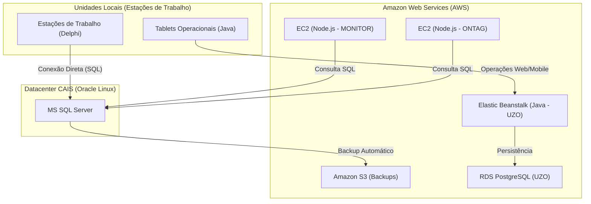

# Infraestrutura de TI - Visão Geral

Este documento apresenta a visão macro da infraestrutura de TI, conectando os ambientes locais, o datacenter CAIS e a nuvem AWS.

## Diagrama de Paisagem (Landscape Diagram)

Este diagrama mostra como os diferentes sistemas e ambientes se comunicam.

## Resumo de Ambientes

| Ambiente | Host / Serviço | Responsabilidade |
| :--- | :--- | :--- |
| **CAIS** | Oracle Linux / MS SQL Server | Banco de dados centralizador (NAVEGANTES, MONITOR, ONTAG) |
| **AWS** | EC2 / Elastic Beanstalk | Hospedagem de backends (Node.js e Java) |
| **AWS** | RDS (PostgreSQL) | Banco de dados dedicado para o sistema UZO |
| **AWS** | S3 Bucket | Armazenamento de backups e recuperação de desastres |
