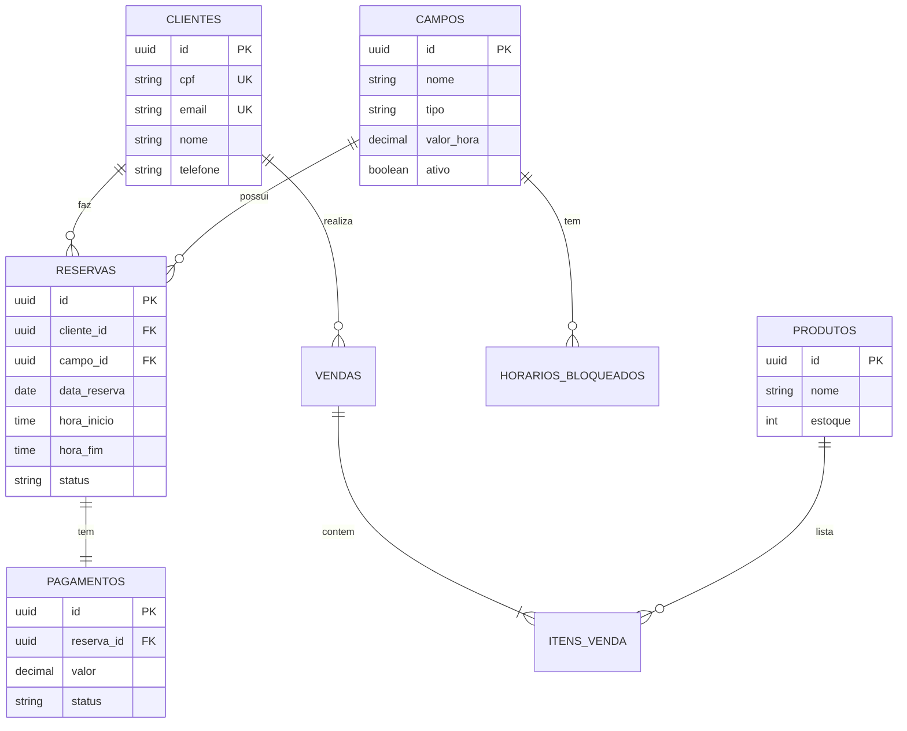

# Football Field Reservation System

Um sistema completo de banco de dados para gerenciamento de reservas de campos de futebol/esportivos.

## Funcionalidades

- Gerenciamento de Clientes e Campos
- Controle de Reservas com validação de horários (anti-chock)
- Sistema Financeiro (Pagamentos)
- Módulo de Lanchonete (Produtos e Vendas) com controle de estoque
- Bloqueio de horários para manutenção
- Relatórios via Views e Functions

## Estrutura do Banco de Dados

### Diagrama ER



## Como Usar

### Pré-requisitos
- Docker e Docker Compose instalados.

### Passos Rápido

1. Clone o repositório ou baixe os arquivos.
2. Na pasta raiz, execute:
   ```bash
   docker-compose up -d
   ```
   Isso iniciará o banco de dados PostgreSQL e executará automaticamente os scripts `schema.sql` e `seeds.sql`.

3. Conecte-se ao banco para validar:
   ```bash
   docker-compose exec db psql -U postgres -d reservations
   ```

### Testando as Views

Dentro do psql, execute:

```sql
-- Ver todas as reservas detalhadas
SELECT * FROM v_reservas_completas;

-- Ver ocupação e receita por campo
SELECT * FROM v_ocupacao_campos;

-- Ver faturamento mensal
SELECT * FROM v_faturamento_mensal;
```

### Testando Functions

```sql
-- Verificar disponibilidade (Retorna t ou f)
-- Parametros: campo_id, data, hora_inicio, hora_fim
SELECT verificar_disponibilidade(
    (SELECT id FROM campos WHERE nome = 'Arena Principal'), 
    CURRENT_DATE + 1, 
    '15:00', 
    '16:00'
);
```

### Regras de Negócio Implementadas

1. **Anti-Overbooking**: Trigger `validar_horario_reserva` impede inserção de reservas que colidam com horários existentes.
2. **Controle de Estoque**: Trigger `atualizar_estoque` deduz quantidade de produtos ao inserir em `itens_venda`.
3. **Auditoria**: Campos `criado_em` e `atualizado_em` (gerenciado por trigger).
